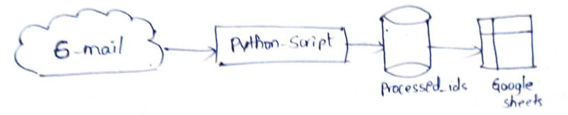

# Gmail to Google Sheets Automation
**Name:** MAILA SRILAXMI

## 1. Project Overview
This tool automates the process of fetching unread emails from a Gmail inbox and logging specific details (Sender, Subject, Date, Content) into a Google Sheet. It is designed to run locally using OAuth 2.0 for secure authentication and prevents duplicate entries.

## 2. Architecture Diagram


## 3. Setup Instructions
1. **Clone the Repository:**
   ```bash
   git clone [https://github.com/](https://github.com/)mailasrilakshmi41/gmail-to-sheets.git
   cd gmail-to-sheets

2. **Install Dependencies:**
    pip install -r requirements.txt

3. **Configure Credentials:**

    Place your Google Cloud credentials.json file inside the credentials/ folder.

    Note: This file is excluded from the repository for security.

4. **Configure Settings:**

     config.py and update the SPREADSHEET_ID with your target Google Sheet ID.

5. **Run the Application:**
    python src/main.py

## 4. Technical Design Decisions

OAuth 2.0 Authentication
I implemented the OAuth 2.0 Desktop Client flow rather than a Service Account. This ensures the script runs with the user's explicit permissions. The gmail_service.py handles the token exchange and saves token.json locally to maintain the session.

Duplicate Prevention & State Persistence
To strictly ensure no duplicate rows are added (as per the "State Persistence" requirement):

Storage: I use a lightweight local file named processed_ids.txt.
Logic:

Every email has a unique Message ID.

Before processing, the script checks if the ID exists in the text file.

If found: The email is skipped.

If not found: The email is parsed, added to Sheets, and the ID is appended to the file.

Reasoning: This approach avoids the complexity of a full database while ensuring the script is state-aware across multiple runs.

## 5. Challenges Faced
Parsing MIME Types: Gmail returns emails in a nested JSON structure. A major challenge was extracting clean text/plain content while ignoring HTML tags. I solved this by writing a recursive parser in email_parser.py and using regex to clean the output.

## 6. Limitations
The script currently ignores file attachments.
Rate limits are handled by Google's standard API quotas.
